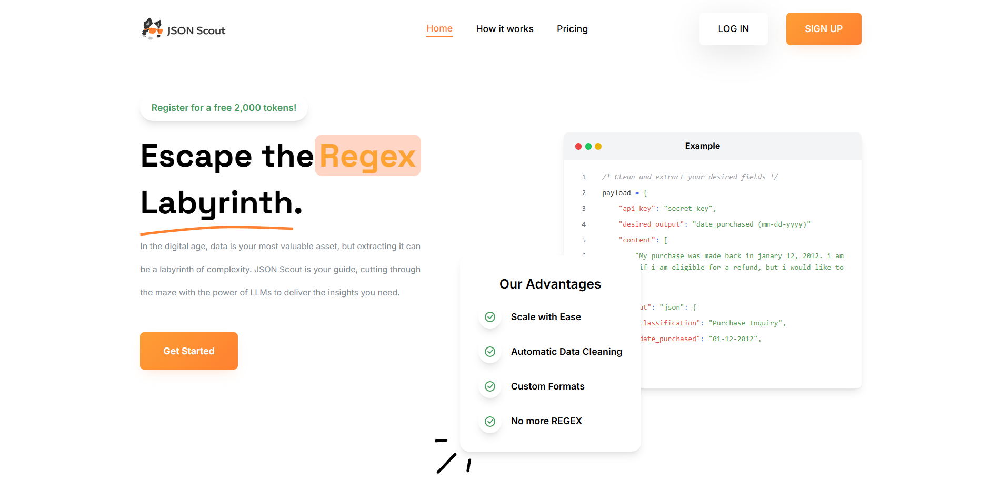

This is a [Next.js](https://nextjs.org/) project bootstrapped with [`create-next-app`](https://github.com/vercel/next.js/tree/canary/packages/create-next-app).

## Getting Started

First, install node modules:

```bash
npm install
```

Second, run development server:

```
npm run dev
```

Open [http://localhost:3000](http://localhost:3000) with your browser to see the result.



This project uses [`next/font`](https://nextjs.org/docs/basic-features/font-optimization) to automatically optimize and load Inter, a custom Google Font.

## Deploy on AWS

This project is live on [https://jsonscout.com](https://jsonscout.com).
